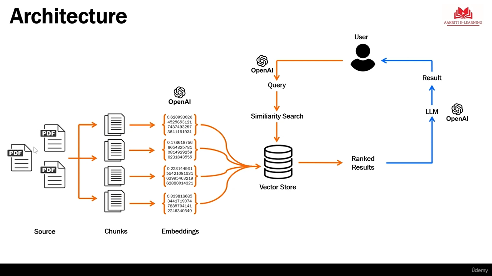

# RAG ChatBot (Generative-Ai-for-Beginners)

## Overview

A **RAG (Retrieval-Augmented Generation) Chatbot** is an AI system that combines retrieval and generation capabilities to provide accurate, context-aware responses. Instead of relying solely on a language model's training data, RAG chatbots retrieve relevant information from an external knowledge base and use that information to generate more accurate, up-to-date, and grounded answers.

## How RAG Works

### 1. **Query Processing**
When a user submits a query, the RAG system processes the input text to understand the user's intent and extract key information needed for retrieval.

### 2. **Retrieval Phase**
The system searches an external knowledge base (documents, databases, or vectorized content) to find relevant information related to the query. This typically uses:
- **Vector similarity search**: Embedding-based retrieval that matches semantic meaning
- **Keyword search**: Traditional text-based search methods
- **Hybrid approaches**: Combining multiple retrieval strategies

### 3. **Augmentation Phase**
The retrieved documents or information chunks are formatted and combined with the original query to create an augmented prompt. This ensures the language model has relevant context.

### 4. **Generation Phase**
A language model uses the augmented prompt to generate a response that is:
- Grounded in actual retrieved data
- More accurate and factual
- Supported by specific sources

### 5. **Response Delivery**
The generated response is returned to the user, often with citations or references to the source documents.

---

## High-Level Architecture

```
┌─────────────────────────────────────────────────────────────┐
│                     USER QUERY                              │
└────────────────────────┬────────────────────────────────────┘
                         │
                         ▼
            ┌────────────────────────┐
            │  Query Preprocessing   │
            │  (Tokenization, etc.)  │
            └────────────┬───────────┘
                         │
                         ▼
            ┌────────────────────────┐
            │  Query Embedding       │
            │  (Vector Conversion)   │
            └────────────┬───────────┘
                         │
                         ▼
        ┌────────────────────────────────────┐
        │    RETRIEVAL COMPONENT             │
        │                                    │
        │  ┌──────────────────────────────┐ │
        │  │   Vector Database / Store    │ │
        │  │  (Embeddings + Documents)    │ │
        │  └──────────────────────────────┘ │
        │                                    │
        │  ┌──────────────────────────────┐ │
        │  │   Similarity Search Engine   │ │
        │  │  (Find K nearest neighbors)  │ │
        │  └──────────────────────────────┘ │
        └────────────┬─────────────────────┘
                     │
                     ▼
        ┌────────────────────────┐
        │  Retrieved Documents   │
        │  (Context Chunks)      │
        └────────────┬───────────┘
                     │
                     ▼
        ┌────────────────────────────────┐
        │    AUGMENTATION COMPONENT      │
        │                                │
        │  Combine:                      │
        │  - Original Query              │
        │  - Retrieved Context           │
        │  - System Instructions         │
        │                                │
        │  → Create Augmented Prompt     │
        └────────────┬───────────────────┘
                     │
                     ▼
        ┌────────────────────────────────┐
        │    GENERATION COMPONENT        │
        │                                │
        │  ┌──────────────────────────┐ │
        │  │   Language Model (LLM)   │ │
        │  │  (e.g., GPT, Llama)      │ │
        │  └──────────────────────────┘ │
        │                                │
        │  ┌──────────────────────────┐ │
        │  │   Response Generation    │ │
        │  │  (Token-by-token)        │ │
        │  └──────────────────────────┘ │
        └────────────┬───────────────────┘
                     │
                     ▼
        ┌────────────────────────────────┐
        │    POST-PROCESSING             │
        │                                │
        │  - Format Response             │
        │  - Add Citations/Sources       │
        │  - Confidence Scoring          │
        └────────────┬───────────────────┘
                     │
                     ▼
        ┌────────────────────────────────┐
        │      FINAL RESPONSE            │
        │   (Answer with References)     │
        └────────────────────────────────┘
```

---



---

## Key Components

### **Retriever**
- Responsible for fetching relevant documents from the knowledge base
- Uses embeddings and similarity metrics
- Examples: FAISS, Weaviate, Pinecone, Elasticsearch

### **Knowledge Base / Vector Store**
- Stores pre-processed and embedded documents
- Enables fast similarity searches
- Can be static or continuously updated

### **Embedding Model**
- Converts text to high-dimensional vectors
- Enables semantic similarity matching
- Examples: Sentence-BERT, OpenAI Embeddings, Hugging Face models

### **Language Model (LLM)**
- Generates natural language responses
- Conditioned on retrieved context
- Examples: GPT-4, LLaMA, Mistral

### **Augmentation Pipeline**
- Formats retrieved information into prompts
- Manages context length and relevance
- Handles prompt engineering

---

## Advantages of RAG

✅ **Accuracy**: Responses are grounded in actual data, reducing hallucinations  
✅ **Currency**: Can retrieve and use up-to-date information  
✅ **Explainability**: Sources are traceable and verifiable  
✅ **Efficiency**: Reduces the need for continuous model retraining  
✅ **Domain-Specific**: Works well with specialized knowledge bases  
✅ **Cost-Effective**: Smaller models can be used with retrieval support  

---

## Limitations

❌ **Retrieval Quality**: Poor document retrieval leads to poor outputs  
❌ **Latency**: Additional retrieval step increases response time  
❌ **Knowledge Base Maintenance**: Requires regular updates and curation  
❌ **Context Window Limits**: LLMs have token limits for input/output  
❌ **Complex Queries**: Multi-hop reasoning may require sophisticated retrieval  

---

## Common Applications

- 📚 **Document Q&A**: Question answering over documents, PDFs, manuals
- 🏢 **Enterprise Search**: Internal knowledge bases and documentation
- 🤖 **Customer Support**: Providing accurate answers from FAQs and knowledge bases
- 📖 **Educational Systems**: Tutoring and learning assistance
- 🔍 **Legal/Medical AI**: Domain-specific Q&A with citations
- 💬 **Chat Interfaces**: Context-aware conversational AI

---

## Implementation Workflow

1. **Data Preparation**
   - Collect and clean documents
   - Split into chunks
   - Remove duplicates and irrelevant content

2. **Embedding Generation**
   - Convert document chunks to embeddings
   - Store in vector database with metadata

3. **Query Processing**
   - Embed user queries
   - Retrieve top-K similar documents

4. **Prompt Augmentation**
   - Format retrieved context
   - Create effective prompts for the LLM

5. **Generation & Response**
   - Generate response with augmented context
   - Format and return to user

---

## Example RAG Stack

```
User Interface
     ↓
Application Layer (Python/FastAPI)
     ↓
Orchestration Layer (LangChain/LlamaIndex)
     ↓
┌─────────────────────────────────────┐
│ Retrieval:        │  Generation:     │
│ - Vector DB       │  - LLM Service   │
│ - Embeddings      │  - Tokenizer     │
│ - Search Engine   │  - Response      │
└─────────────────────────────────────┘
     ↓
Knowledge Base & Models (Disk/Cloud)
```

---

## Getting Started

To build a RAG chatbot, you typically need:

1. **Libraries**: `langchain`, `llama-index`, `faiss`, `openai`, `transformers`
2. **Vector Database**: `Pinecone`, `Weaviate`, `Qdrant`, or `FAISS`
3. **LLM**: Access to `GPT`, `Llama`, `Mistral`, or similar
4. **Embedding Model**: Sentence transformers or API-based embeddings
5. **Data**: Curated knowledge base relevant to your use case

---

## References & Further Reading

- [Retrieval-Augmented Generation Paper](https://arxiv.org/abs/2005.11401)
- [LangChain Documentation](https://python.langchain.com/)
- [LLaMA Index](https://www.llamaindex.ai/)
- [Vector Databases Overview](https://www.pinecone.io/learn/vector-database/)
- [Prompt Engineering Guide](https://www.promptingguide.ai/)

